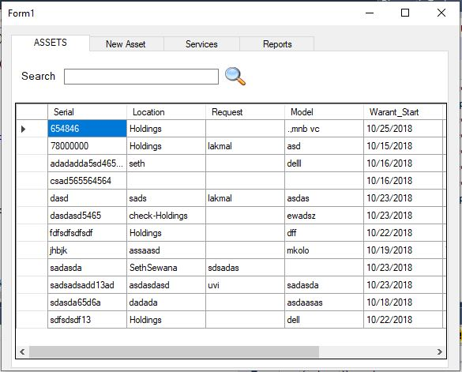
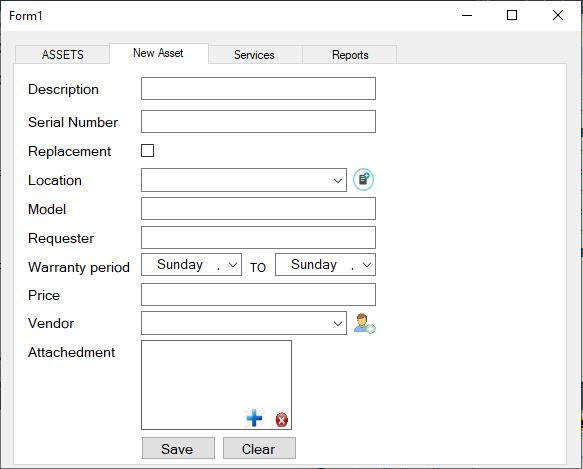
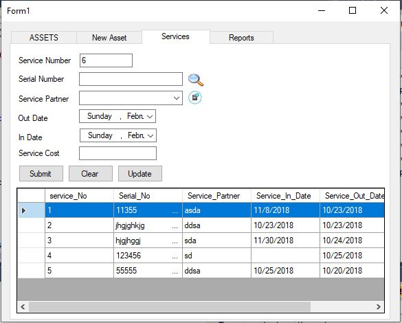
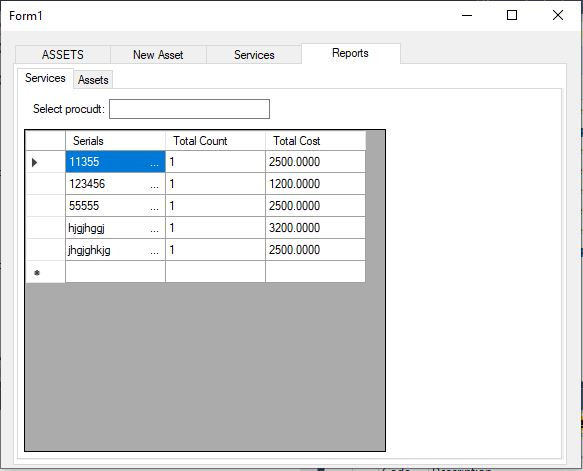

# Asset Manager -C#

Asset Manager is an management software tool to manage organizational assets. It has ability to maintain a record from current assets and their services. By monitoring the assets it's very easy to maintain them. This software main interface consists of four main parts:

    * Assets
    * Add new Asset
    * Services
    * Reports
    

## Assets

In this page menu you can view the all the asset in the organization, search asset, add new asset types and delete assets. All of those functionalities include in the **asset** section.

     
     
     
     
 